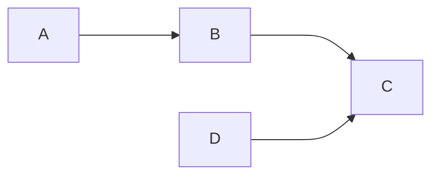

# markdown

```python
print("Hello World!")
```

```javascript
console.log("Hello World!")
```


```mermaid
flowchart LR
A ---> B ---> C
D ---> C
```

헤더1|헤더2|헤더3|헤더4
---|---|---|---
셀1|셀2|셀3|셀4
셀5|셀6|셀7|셀8
셀9|셀10|셀11|셀12
